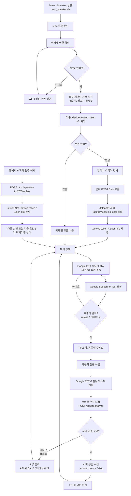

```mermaid
flowchart TD
    A["Jetson Speaker 실행<br/>./run_speaker.sh"] --> B[".env 설정 로드"]
    B --> C["인터넷 연결 확인"]
    C --> D{"인터넷 연결됨?"}

    D -- "아니오" --> E["Wi-Fi 설정 서버 실행"]
    E --> C

    D -- "예" --> F["로컬 페어링 서버 시작<br/>mDNS 광고 + :8765"]
    F --> G["기존 .device-token / .user-info 확인"]
    G --> H{"토큰 있음?"}

    H -- "없음" --> I["앱에서 스피커 검색"]
    I --> J["앱이 POST /pair 호출"]
    J --> K["Jetson이 서버 /api/devices/link-local 호출"]
    K --> L[".device-token / .user-info 저장"]

    H -- "있음" --> M["저장된 토큰 사용"]
    L --> N["대기 상태"]
    M --> N

    N --> O["Google STT 깨우기 감지<br/>2초 단위 짧은 녹음"]
    O --> P["Google Speech-to-Text 요청"]
    P --> Q{"호출어 감지?<br/>지누야 / 진우야 등"}

    Q -- "아니오" --> O
    Q -- "예" --> R["TTS: 네, 말씀해 주세요"]
    R --> S["사용자 질문 녹음"]
    S --> T["Google STT로 질문 텍스트 변환"]
    T --> U["서버로 분석 요청<br/>POST /api/stt-analyze"]
    U --> V{"서버 인증 성공?"}

    V -- "아니오<br/>401 등" --> W["오류 출력<br/>API 키 / 토큰 / 페어링 확인"]
    W --> N

    V -- "예" --> X["서버 응답 수신<br/>answer / score / risk"]
    X --> Y["TTS로 답변 읽기"]
    Y --> N

    Z["앱에서 스피커 연결 해제"] --> AA["POST http://speaker-ip:8765/unlink"]
    AA --> AB["Jetson에서 .device-token / .user-info 삭제"]
    AB --> AC["다음 실행 또는 다음 요청부터 미페어링 상태"]
    AC --> N
```
