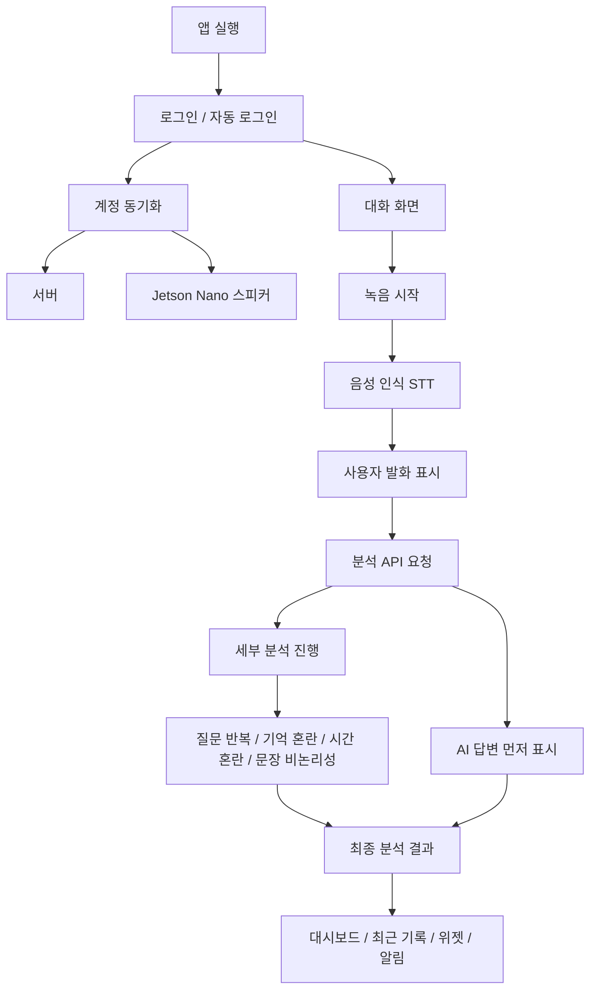

```mermaid
flowchart TD
    A["앱 실행"] --> B["로그인 / 자동 로그인"]
    B --> C["계정 동기화"]
    C --> D["서버"]
    C --> E["Jetson Nano 스피커"]

    B --> F["대화 화면"]
    F --> G["녹음 시작"]
    G --> H["음성 인식 STT"]
    H --> I["사용자 발화 표시"]

    I --> J["분석 API 요청"]
    J --> K["AI 답변 먼저 표시"]
    J --> L["세부 분석 진행"]

    L --> M["질문 반복 / 기억 혼란 / 시간 혼란 / 문장 비논리성"]
    M --> N["최종 분석 결과"]

    K --> N
    N --> O["대시보드 / 최근 기록 / 위젯 / 알림"]
```
