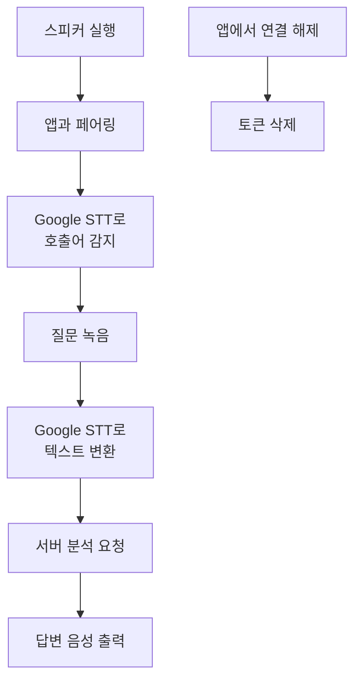

```mermaid
flowchart TD
    A["스피커 실행"] --> B["앱과 페어링"]
    B --> C["Google STT로<br/>호출어 감지"]
    C --> D["질문 녹음"]
    D --> E["Google STT로<br/>텍스트 변환"]
    E --> F["서버 분석 요청"]
    F --> G["답변 음성 출력"]

    H["앱에서 연결 해제"] --> I["토큰 삭제"]
```
